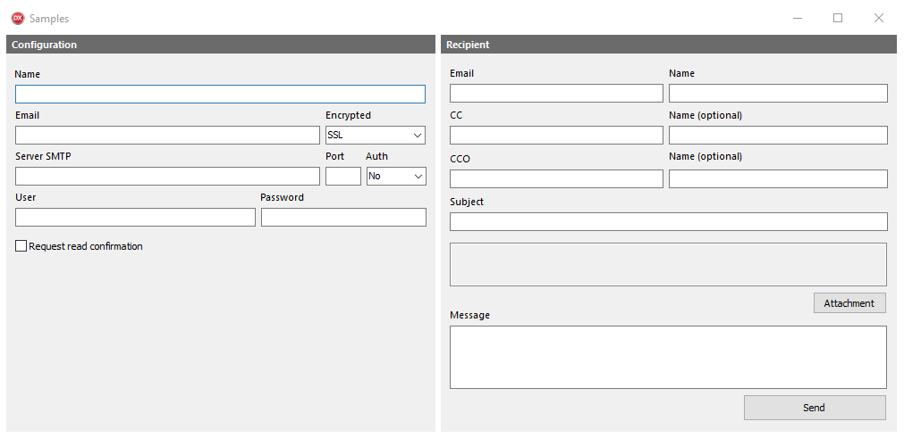

[](https://github.com/juliosenha/mail4delphi/issues?utf8=✓&q=is%3Aissue+is%3Aopen+label%3Abug)


[](https://github.com/juliosenha/mail4delphi/blob/master/license.txt)

<p align="center"><br>
  <b>Mail4Delphi</b> uses the Indy component to send the email.! <br><br>
  <br>
</p>

## Prerequisites
* `[Required]` You need to have the libeay32.dll and ssleay32.dll dynamic library files. 

 * `[Optional]` For ease I recommend using the [**Boss**](https://github.com/HashLoad/boss) (Dependency Manager for Delphi) for installation, simply by running the command below on a terminal (Windows PowerShell for example):
```
boss install github.com/juliosenha/mail4delphi
```

## Manual Installation
If you choose to install manually, simply add the following folder to your project, in *Project > Options > Resource Compiler > Directories and Conditionals > Include file search path*
```
../mail4delphi/src
```

## Getting Started
```pascal
uses Mail4Delphi;
```

## Send email
```pascal
begin
  TMail.New
    .AddFrom('from', 'name')
    .SSL(true)
    .Host('host')
    .Port(443)
    .Auth(true)
    .UserName('user')
    .Password('pass')
    .ReceiptRecipient(false)
    .AddCC('cc', 'name')
    .AddBCC('cco', 'name')
    .AddTo('to', 'name')
    .AddSubject('subject')
    .AddBody('message')
    .AddAttachment(nil)
    .SendMail;
end;
```

## Samples
Check out our sample project for each situation presented above in operation. If you have any questions or suggestion, please contact, make your pull request or create an issue.



## License

`Mail4Delphi` is free and open-source software licensed under the [MIT License](https://github.com/juliosenha/mail4delphi/blob/master/LICENSE).

:point_right: *Alone we go faster. Together we go further.*
